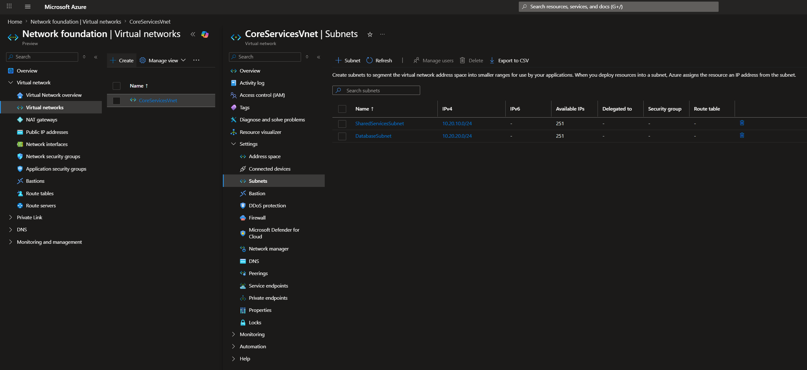
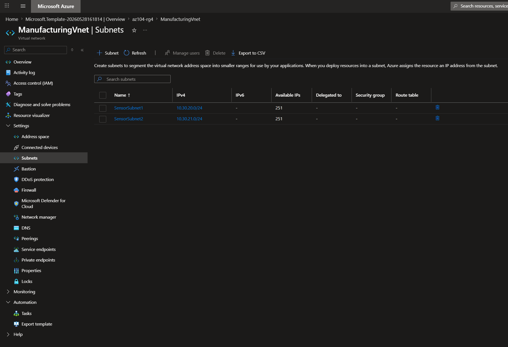
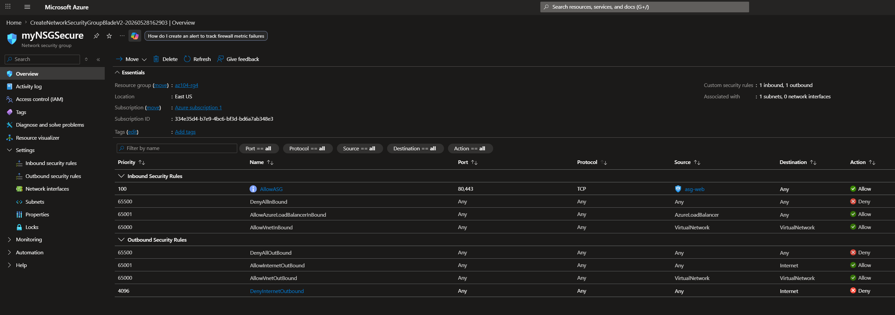
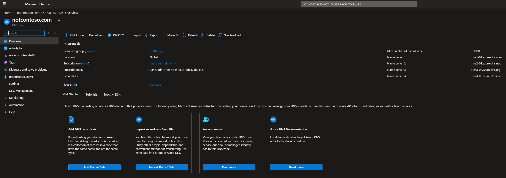
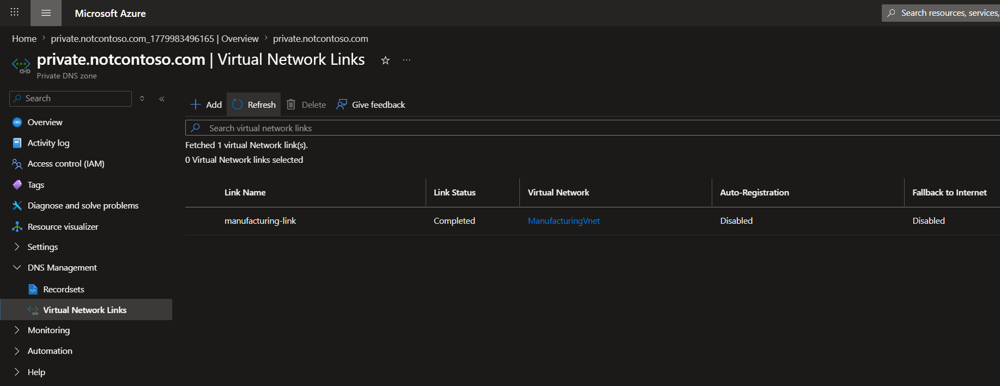

# Lab 04 – Azure Virtual Networking (VNet, NSG, ASG, DNS)

## 📌 Project Context
This project is part of my AZ-104 Azure Administrator learning path.  
It focuses on designing and implementing a foundational cloud networking architecture using Microsoft Azure services.

The goal is to simulate a scalable enterprise network environment with proper segmentation, security controls, and name resolution strategies.

---

## 🎯 Objective
Design and implement a secure and scalable Azure network architecture using:

- Virtual Networks (VNets)
- Subnets for workload segmentation
- Network Security Groups (NSGs)
- Application Security Groups (ASGs)
- Public and Private DNS zones

This lab demonstrates core principles of cloud networking including isolation, segmentation, and secure communication between workloads.

---

## 🏗️ Architecture Overview

### Virtual Networks

- **CoreServicesVnet** → `10.20.0.0/16`  
- **ManufacturingVnet** → `10.30.0.0/16`

These VNets represent separate workload domains to simulate enterprise-level segmentation.

---

### Subnet Design

#### CoreServicesVnet
- SharedServicesSubnet → `10.20.10.0/24`
- DatabaseSubnet → `10.20.20.0/24`

#### ManufacturingVnet
- SensorSubnet1 → `10.30.20.0/24`
- SensorSubnet2 → `10.30.21.0/24`

Subnetting was used to logically separate workloads and prepare for future scaling requirements.

---

## 🔐 Network Security Implementation

### Application Security Group (ASG)
- `asg-web` created to logically group application-tier resources

ASGs allow dynamic grouping of workloads without relying on static IP addressing.

---

### Network Security Group (NSG)

- `myNSGSecure` associated with SharedServicesSubnet

#### Inbound Security Rule
- Allows HTTP/HTTPS traffic (80, 443)
- Source: Application Security Group (asg-web)
- Purpose: enforce controlled access to application workloads

#### Outbound Security Rule
- Denies all internet-bound traffic
- Implements a basic Zero Trust outbound security model

---

## 🌐 DNS Architecture

### Public DNS Zone
- Public DNS zone configured with A record (`www`)
- Simulates external name resolution for public-facing services

### Private DNS Zone
- `private.contoso.com`
- Linked to ManufacturingVnet via virtual network link
- Enables internal-only name resolution for workloads

This setup demonstrates separation between public and internal DNS resolution layers.

---

## 📸 Evidence

### Virtual Network & Subnets

### ARM Template Deployment

### NSG Configuration

### DNS Configuration

---

## 🧠 Key Engineering Concepts

- IP address planning is critical for scalable cloud architecture design
- VNets provide network isolation boundaries in Azure
- Subnets enable workload segmentation and future scalability
- NSGs enforce stateful traffic filtering at subnet level
- ASGs simplify security rule management for dynamic environments
- Public vs Private DNS separation supports hybrid and secure architectures

---

## ⚠️ Challenges & Learnings

- Designing non-overlapping IP address spaces across VNets
- Understanding NSG rule priority (lower value = higher priority)
- Correctly linking Private DNS zones to VNets for resolution
- Maintaining consistency across ARM template modifications
- Differentiating between public and private name resolution scopes

---

## 🔄 Real-World Architecture Mapping

In production environments, this design pattern maps to:

- VNets → Business units or environment separation (Dev/Test/Prod)
- Subnets → Tiered application architecture (Web / App / Data)
- NSGs → Zero Trust network enforcement layer
- ASGs → Scalable security group abstraction for workloads
- DNS Zones → Hybrid cloud and internal service discovery

All resources would typically be deployed using Infrastructure as Code (IaC) pipelines rather than manual portal configuration.

---

## 🧰 Technologies Used

- Microsoft Azure Portal
- Azure Virtual Networks (VNet)
- Azure Subnets
- Network Security Groups (NSG)
- Application Security Groups (ASG)
- Azure DNS (Public & Private)
- ARM Templates (Infrastructure as Code)

---

## 🚀 Next Steps

This lab is a foundation for more advanced networking architectures:

- Hub-and-Spoke network topology
- VNet Peering and transitive routing
- User Defined Routes (UDR)
- VPN Gateway / ExpressRoute integration
- Azure Firewall centralized security architecture