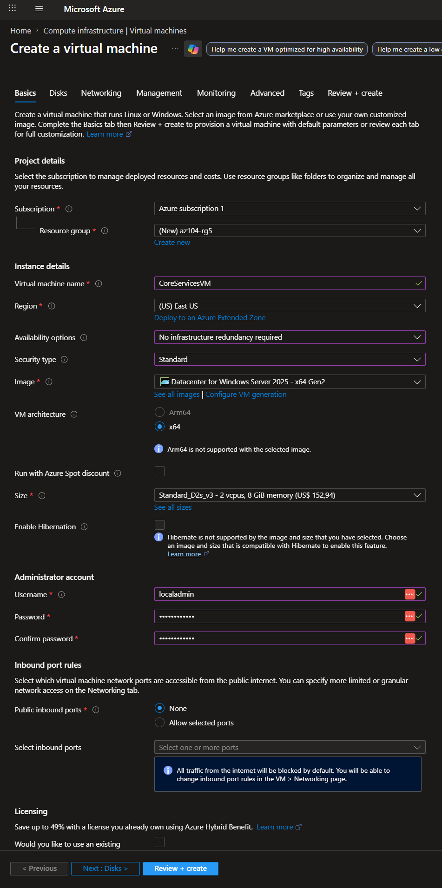
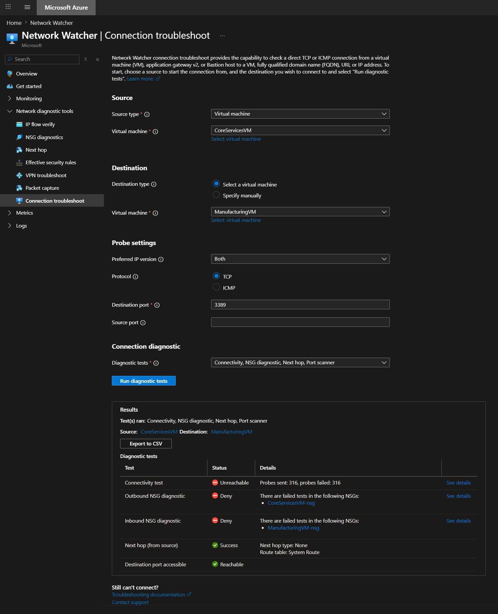
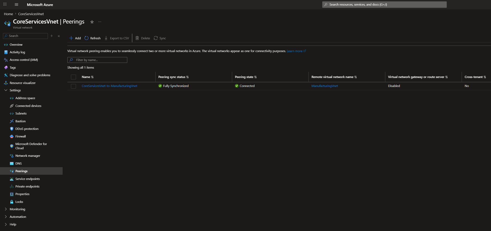
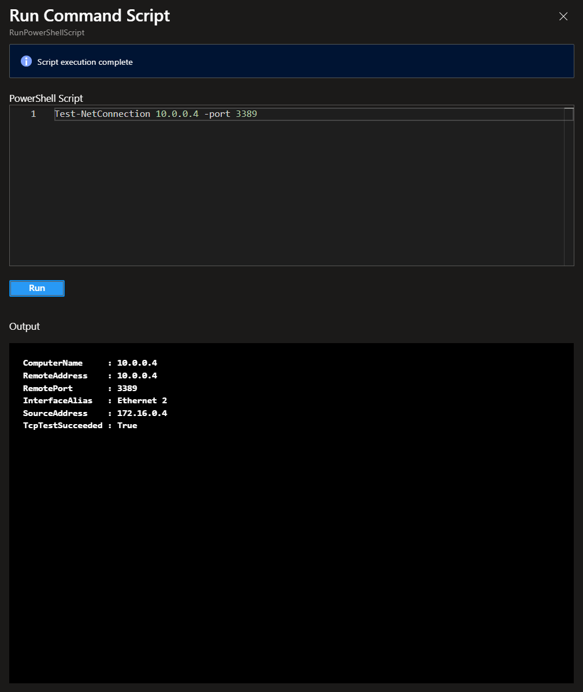
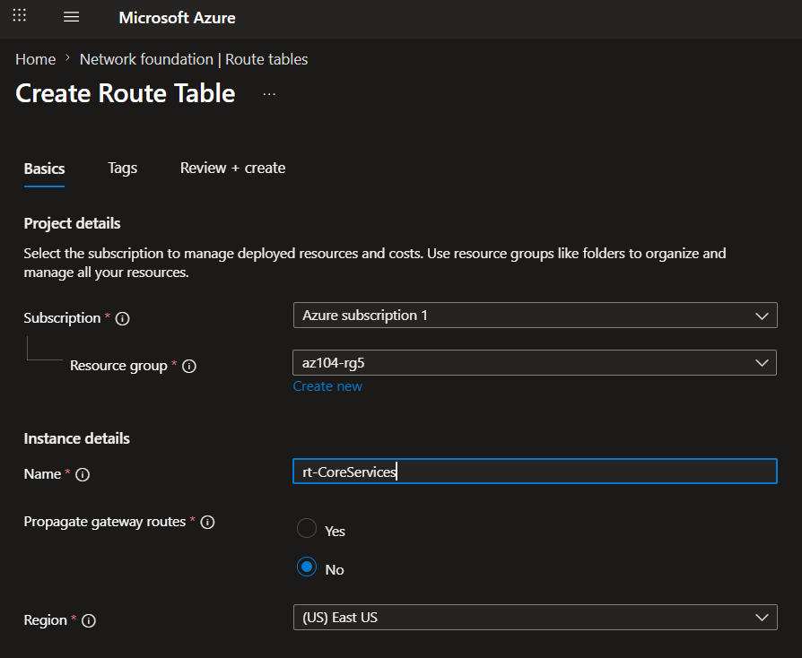
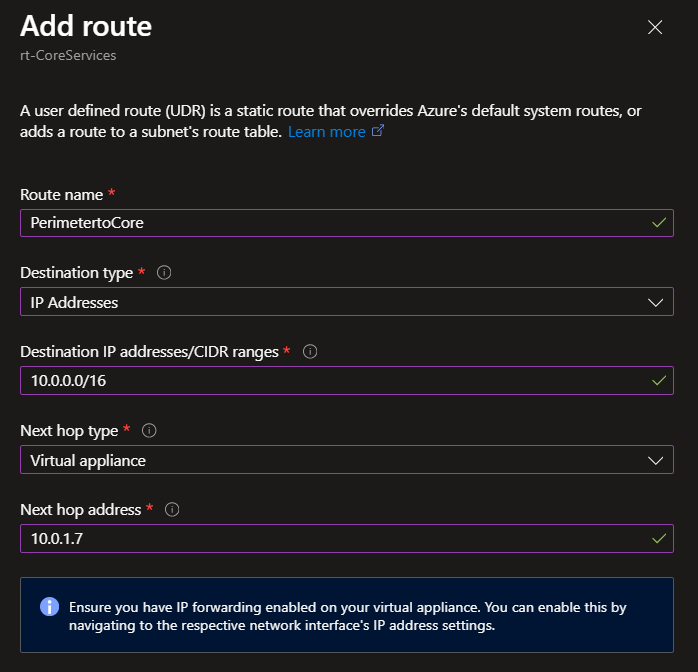

# Lab 05 – Azure Intersite Connectivity (VNet Peering, Network Watcher & Custom Routing)

## 📌 Project Context

This project is part of my AZ-104 Azure Administrator learning path.

The focus of this lab is establishing secure communication between isolated Azure virtual networks while maintaining network segmentation and administrative boundaries.

The lab simulates a common enterprise scenario where different business units or environments require controlled connectivity without exposing traffic to the public internet.

---

## 🎯 Objective

Design and implement secure inter-network communication using:

* Azure Virtual Networks (VNets)
* Virtual Machines
* VNet Peering
* Azure Network Watcher
* User Defined Routes (UDRs)
* Route Tables

This lab demonstrates how Azure enables private connectivity between separate network environments while providing visibility and control over traffic flows.

---

## 🏗️ Architecture Overview

### Virtual Networks

#### CoreServicesVnet

* Address Space: `10.0.0.0/16`
* Subnet: `10.0.0.0/24`

#### ManufacturingVnet

* Address Space: `172.16.0.0/16`
* Subnet: `172.16.0.0/24`

The virtual networks represent separate operational domains within an organization.

* Core Services → Shared IT infrastructure
* Manufacturing → Business workload environment

Initially, no communication exists between these networks.

---

## 💻 Virtual Machine Deployment

### Core Services Environment

* Virtual Machine: `CoreServicesVM`
* Operating System: Windows Server 2025
* Network: CoreServicesVnet

### Manufacturing Environment

* Virtual Machine: `ManufacturingVM`
* Operating System: Windows Server 2025
* Network: ManufacturingVnet

The virtual machines simulate workloads located in separate network segments.

---

## 🔍 Connectivity Validation

### Azure Network Watcher

Before configuring connectivity, Azure Network Watcher was used to test communication between both virtual machines. This step established a baseline to confirm network isolation before implementing VNet Peering.

#### Initial Result

* Source: CoreServicesVM
* Destination: ManufacturingVM
* Protocol: TCP
* Port: 3389 (RDP)

Result:

* Connectivity Status: **Unreachable**

This confirms that Azure virtual networks remain isolated unless connectivity mechanisms are explicitly configured.

---

## 🔗 Virtual Network Peering

### Peering Configuration

A bidirectional VNet Peering was configured:

* CoreServicesVnet → ManufacturingVnet
* ManufacturingVnet → CoreServicesVnet

#### Benefits of VNet Peering

* Private Azure backbone communication
* Low latency connectivity
* No public internet exposure
* Simplified network architecture

After peering was established, both virtual networks could communicate securely through Azure's private infrastructure.

---

## 🧪 Connectivity Testing (Post-Peering Validation)

After configuring VNet Peering, connectivity between both virtual machines was re-tested using Azure Run Command and PowerShell.

Before validating connectivity, the Windows Firewall on CoreServicesVM was updated to allow Remote Desktop traffic.

### 🔧 Firewall Configuration

The following command was executed via Azure Run Command:

```powershell
Enable-NetFirewallRule -DisplayGroup "Remote Desktop"
```
### 🔍 Connectivity Test

From ManufacturingVM, connectivity was validated using:

```powershell
Test-NetConnection <CoreServicesVM Private IP> -Port 3389
```

#### Result

- TCP Connectivity: **Successful**
- Network Reachability: **Confirmed**
- Port: **3389**

### 🧠 Conclusion

This confirmed that private communication between both virtual machines across different virtual networks was successfully established via Azure’s private backbone network after VNet Peering and firewall configuration.

---

## 🛣️ Custom Routing Implementation

### Perimeter Subnet

An additional subnet was created within CoreServicesVnet:

* Perimeter → `10.0.1.0/24`

This subnet simulates a DMZ (Demilitarized Zone) where a Network Virtual Appliance (NVA) would typically be deployed for traffic inspection and security enforcement.

---

### Route Table

A custom route table was created:

* Route Table: `rt-CoreServices`

### User Defined Route (UDR)

A custom route table (`rt-CoreServices`) was created to control traffic flow between subnets.

| Setting | Value |
|--------|------|
| Destination | 10.0.0.0/16 |
| Next Hop Type | Virtual Appliance |
| Next Hop Address | 10.0.1.7 |

This demonstrates how Azure route tables can be used to enforce controlled traffic inspection paths instead of direct VNet routing.
---

## 📸 Evidence

### Virtual Machine Deployments



### Network Watcher Connectivity Test



### VNet Peering Configuration



### PowerShell Connectivity Validation



### Route Table Configuration



### User Defined Route



---

## 🧠 Key Engineering Concepts

* Azure VNets are isolated by default
* VNet Peering enables secure private communication between networks
* Network Watcher provides network diagnostics and troubleshooting capabilities
* User Defined Routes override Azure system routes
* Route Tables allow administrators to control traffic flow
* Network Virtual Appliances can be integrated for traffic inspection and security enforcement

---

## ⚠️ Challenges & Learnings

* Understanding Azure's default network isolation model
* Configuring bidirectional VNet Peering correctly
* Troubleshooting connectivity using Network Watcher
* Validating connectivity using PowerShell tools
* Understanding route precedence and custom routing behavior
* Associating route tables with the correct subnet

---

## 🔄 Real-World Architecture Mapping

In production environments, this architecture pattern maps to:

* CoreServicesVnet → Shared Services Network
* ManufacturingVnet → Business Unit Network
* VNet Peering → Inter-department connectivity
* Route Tables → Traffic engineering and segmentation
* Network Virtual Appliances → Firewall and inspection services
* Perimeter Subnets → DMZ architectures

This design is commonly used in enterprise Azure environments where multiple departments, environments, or subsidiaries require secure communication while maintaining separation and governance.

---

## 🧰 Technologies Used

* Microsoft Azure Portal
* Azure Virtual Networks (VNet)
* Azure Virtual Machine (VM)
* Azure VNet Peering
* Azure Network Watcher
* Azure Route Tables
* User Defined Routes (UDR)
* Azure PowerShell

---

## 🚀 Next Steps

This lab provides the foundation for more advanced Azure networking scenarios:

* Hub-and-Spoke architectures
* Azure Firewall deployment
* VPN Gateway connectivity
* ExpressRoute integration
* Network Virtual Appliances (NVA)
* Centralized security inspection
* Hybrid cloud networking
