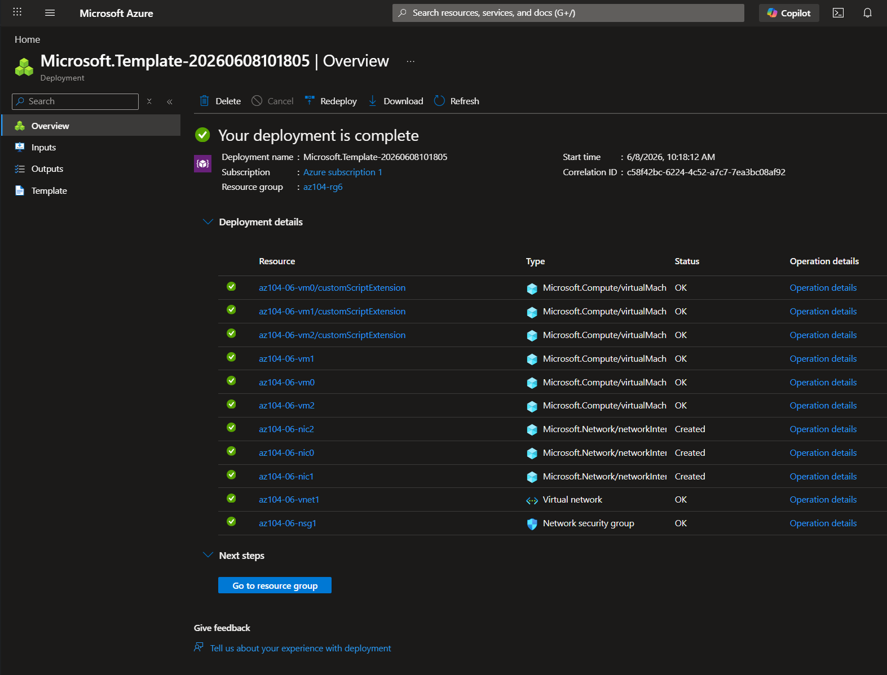
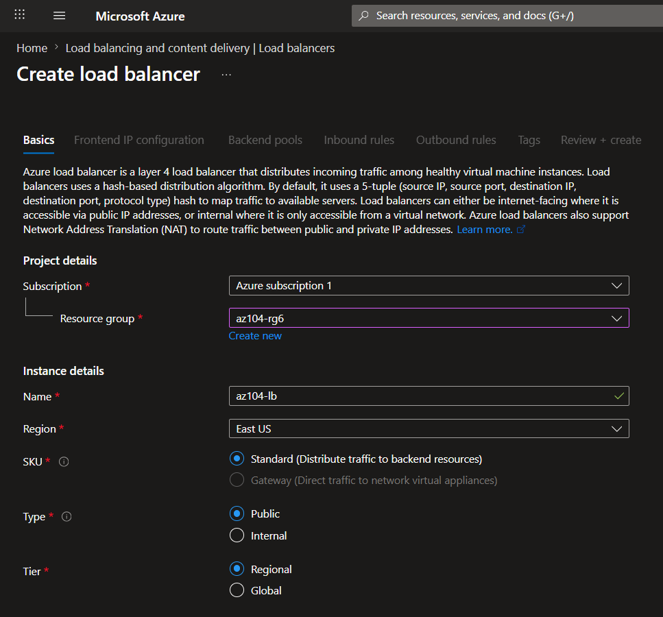
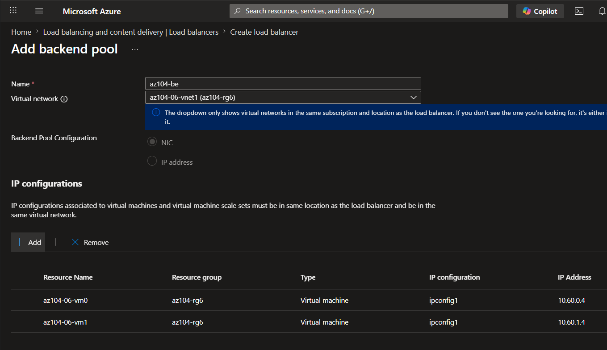
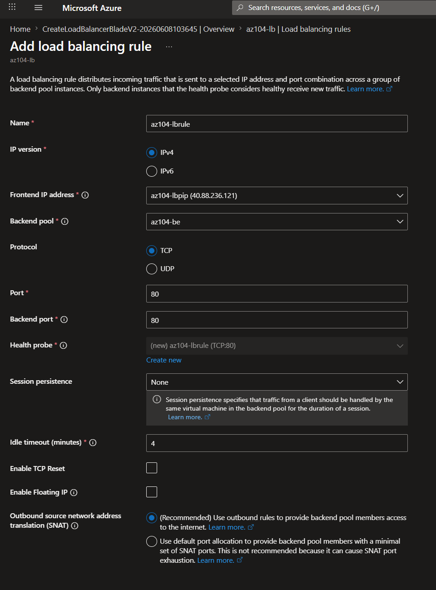
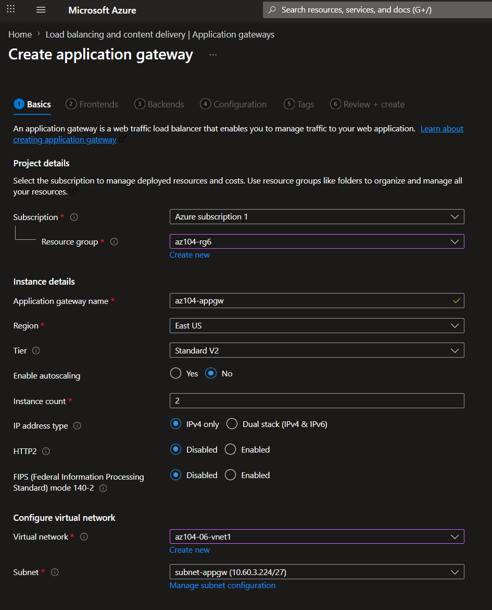
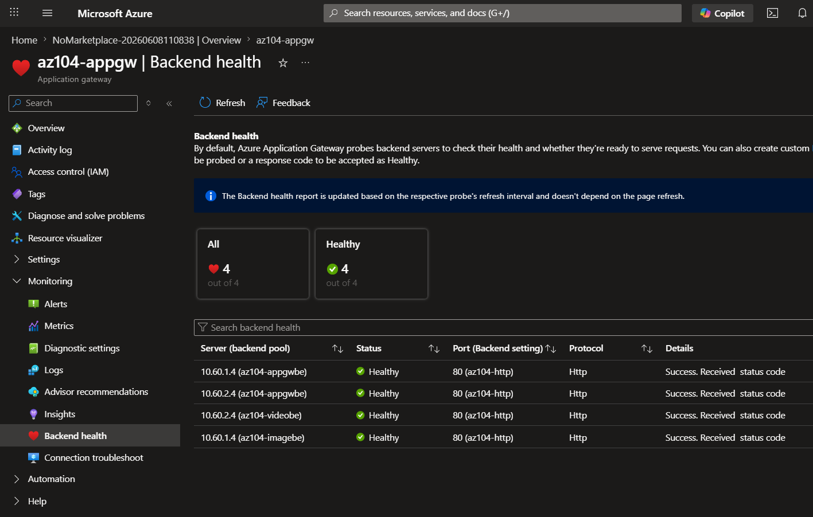
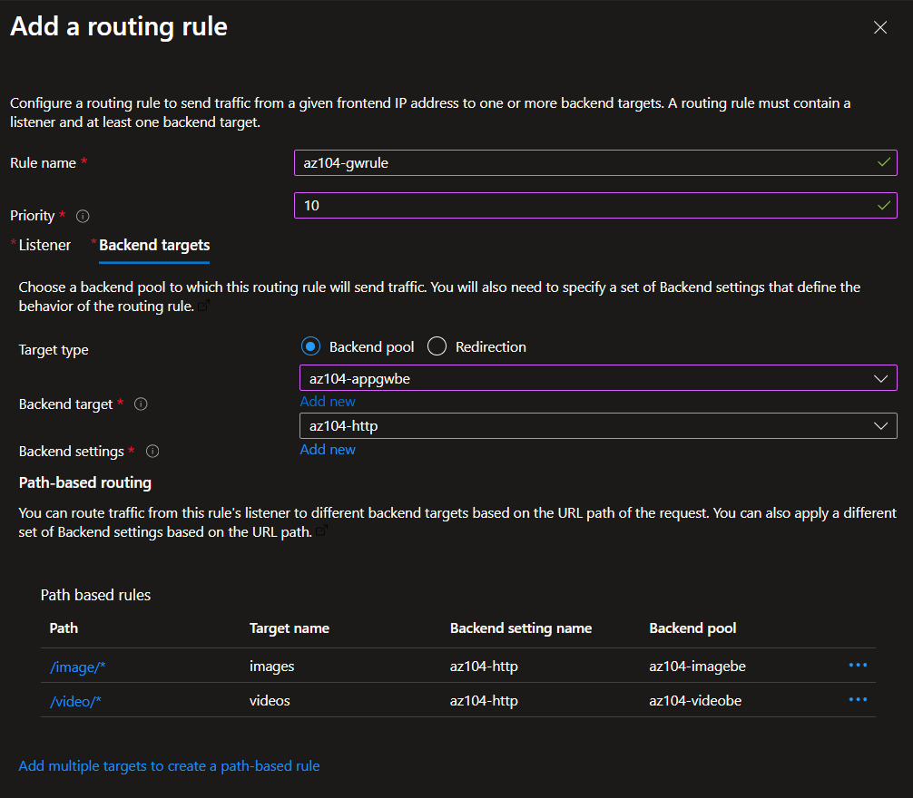

# Lab 06 – Azure Network Traffic Management (Load Balancer & Application Gateway)

## 📌 Project Context

This project is part of my AZ-104 Azure Administrator learning path.

The focus of this lab is implementing Azure traffic management solutions to improve availability, scalability, and traffic distribution across application workloads.

The lab demonstrates both Layer 4 and Layer 7 load balancing technologies available in Microsoft Azure.

---

## 🎯 Objective

Design and implement Azure traffic management services using:

* Azure Load Balancer
* Azure Application Gateway
* Backend Pools
* Health Probes
* Load Balancing Rules
* Path-Based Routing

The goal is to understand how Azure distributes incoming client requests and routes traffic to backend resources based on network or application-level information.

---

## 🏗️ Architecture Overview

### Azure Load Balancer (Layer 4)

The Azure Load Balancer distributes incoming TCP traffic across multiple backend virtual machines.

#### Components

* Public Frontend IP
* Backend Pool
* Health Probe
* Load Balancing Rule

#### Backend Virtual Machines

* az104-06-vm0
* az104-06-vm1

Traffic is only distributed to healthy backend servers based on Load Balancer rules and health probe results.

#### Health Monitoring

A TCP Health Probe continuously monitors backend server availability on port 80.

Only healthy backend virtual machines receive incoming client requests. If a backend server becomes unavailable, Azure automatically removes it from the load balancing rotation until it becomes healthy again. It distributes traffic at the transport layer (TCP/UDP) without inspecting application data.

---

### Azure Application Gateway (Layer 7)

The Azure Application Gateway provides intelligent Layer 7 traffic management for web applications by inspecting HTTP requests and routing traffic based on application-level information.

#### Backend Pools

##### General Application Pool

* az104-06-nic1 (VM1 - image server)
* az104-06-nic2 (VM2 - video server)

##### Image Backend Pool

* az104-06-nic1

##### Video Backend Pool

* az104-06-nic2

---

## 🔍 Traffic Routing Design

### Load Balancer Routing

Incoming traffic:

Client → Azure Load Balancer → VM0 / VM1

Routing decisions are based on:

* IP Address
* TCP Port

The Load Balancer does not inspect application-layer data such as HTTP headers or URLs.

---

### Application Gateway Routing

Incoming traffic:

Client → Application Gateway

Routing Rules:

* `/image/*` → Image Backend Pool
* `/video/*` → Video Backend Pool

The Application Gateway evaluates HTTP requests and routes traffic based on URL paths.

---

## 🧪 Validation

### Load Balancer Testing

Validated:

* Frontend Public IP connectivity
* Health Probe status
* Backend Pool membership
* Traffic distribution between VM0 and VM1

Observed results:

* Requests alternated between backend virtual machines, confirming load distribution.
* High availability confirmed

---

### Application Gateway Testing

Validated:

* Backend health status
* HTTP listener functionality
* Path-based routing configuration

Results:

* `/image/` successfully routed to image server
* `/video/` successfully routed to video server

---

## 📸 Evidence

### Infrastructure Deployment

### Load Balancer Configuration

### Backend Pool Configuration

### Load Balancing Rule

### Application Gateway Overview

### Backend Health

### Path-Based Routing

---

## 🧠 Key Engineering Concepts

### Azure Load Balancer

* Operates at OSI Layer 4
* Supports TCP and UDP traffic (in this lab TCP is used for HTTP traffic).
* Uses Health Probes to determine backend availability
* Provides high availability and fault tolerance

### Azure Application Gateway

* Operates at OSI Layer 7
* Understands HTTP and HTTPS traffic
* Supports path-based routing
* Can perform SSL termination
* Supports Web Application Firewall (WAF)
* Acts as a reverse proxy for HTTP/HTTPS traffic and enables advanced routing decisions at the application layer

### Health Probes

Health probes continuously monitor backend resources and ensure traffic is only sent to healthy targets.

### Backend Pools

Backend pools group resources that receive incoming requests.

### Layer 4 vs Layer 7 Traffic Management

Azure Load Balancer operates at Layer 4 of the OSI model and makes routing decisions based on network information such as:

* Source IP Address
* Destination IP Address
* TCP/UDP Ports

Azure Application Gateway operates at Layer 7 and understands HTTP and HTTPS traffic.

This allows routing decisions based on:

* URL paths
* Host names
* HTTP headers
* Cookies

Because Application Gateway can inspect application-layer traffic, it supports advanced features such as path-based routing, SSL termination, and Web Application Firewall (WAF) protection.

---

## ⚠️ Challenges & Learnings

* Understanding the difference between Layer 4 and Layer 7 load balancing
* Configuring backend pools correctly
* Creating health probes and load balancing rules
* Validating backend health
* Implementing path-based routing
* Understanding how Application Gateway differs from Azure Load Balancer

---

## 🔄 Real-World Architecture Mapping

This architecture maps to common enterprise scenarios:

### Azure Load Balancer

* High availability web servers
* Internal application services
* VM-based workloads

### Azure Application Gateway

* Reverse proxy deployments
* Web applications
* API gateways
* SSL offloading
* Web Application Firewall (WAF) protection

---

## 💼 Business Value

This solution improves application availability and scalability by distributing client traffic across multiple backend servers.

Azure Load Balancer provides high availability for infrastructure workloads, while Azure Application Gateway enables intelligent application-level routing through a single public endpoint.

This architecture pattern is commonly used in enterprise environments to improve resiliency, simplify traffic management, and support scalable web applications.

---

## 🚀 Beyond the Lab

In production environments, this solution would typically include:

* HTTPS listeners
* SSL certificates
* Web Application Firewall (WAF)
* Azure Monitor integration
* Centralized logging
* Autoscaling
* Zone redundancy
* DDoS Protection

---

## 🧰 Technologies Used

* Microsoft Azure Portal
* Azure Load Balancer
* Azure Application Gateway
* Azure Virtual Machines
* Azure Virtual Networks
* Azure Backend Pools
* Azure Health Probes
* Azure Routing Rules

---

## 🚀 Next Steps

This lab provides the foundation for more advanced traffic management solutions:

* Azure Front Door
* Azure Traffic Manager
* Azure Firewall
* Web Application Firewall (WAF)
* SSL Offloading
* Multi-Region Architectures
* Zero Trust Networking
