# Lab 07 – Manage Azure Storage

## 📌 Project Context

This project is part of my AZ-104 Azure Administrator learning path.

The focus of this lab is configuring and securing Azure Storage services, including Blob Storage and Azure File Shares.

The lab demonstrates how Azure Storage supports secure data access, lifecycle management, redundancy, and network-based access controls. It also explores different authentication and authorization mechanisms used to protect enterprise storage workloads.

---

## 🎯 Objective

Design and configure secure storage solutions using:

* Azure Storage Accounts
* Azure Blob Storage
* Azure File Shares
* Shared Access Signatures (SAS)
* Role-Based Access Control (RBAC)
* Lifecycle Management Policies
* Virtual Networks and Service Endpoints

The goal is to understand how Azure Storage can securely store, protect, and manage data while optimizing costs and controlling access.

---

## 🏗️ Architecture Overview

### Storage Account

A single Azure Storage Account serves as the central storage platform for:

* Blob Storage (unstructured data)
* Azure File Shares (managed SMB file storage)

The storage account is configured with Geo-Redundant Storage (GRS) to provide resilience and disaster recovery capabilities.

---

### Storage Security

Multiple security layers were implemented:

#### Identity-Based Access

* Microsoft Entra ID authentication
* RBAC role assignments
* Storage Blob Data Contributor
* Storage File Data Privileged Contributor

#### Temporary Delegated Access

* Shared Access Signature (SAS)
* User Delegation Key authentication
* Time-limited access permissions

#### Network Security

* Public access restricted
* Access limited to approved networks
* Virtual Network integration
* Microsoft.Storage Service Endpoint

---

### Data Protection

Implemented data protection mechanisms include:

* Soft delete retention settings
* Immutable blob storage policy
* 180-day time-based retention policy
* Geo-Redundant Storage (GRS)

---

## 🔍 Storage Design

### Blob Storage

A private blob container was created to store unstructured data.

Features configured:

* Private container access
* Block blob upload
* Hot access tier
* Immutable retention policy
* SAS-based secure access

Anonymous public access was intentionally blocked to enforce secure access practices.

---

### Azure File Shares

An Azure File Share was deployed and managed through Storage Browser.

Features configured:

* SMB-compatible file share
* Transaction Optimized access tier
* File upload and management
* Microsoft Entra ID authentication

---

## 🧪 Validation

### Storage Account

Validated:

* Successful deployment
* Geo-Redundant Storage configuration
* Lifecycle management policy creation
* Network configuration

---

### Blob Storage

Validated:

* Private container creation
* File upload functionality
* Public URL access denied
* SAS token generation
* Temporary secure access via SAS URL

Observed results:

* Anonymous access blocked successfully
* SAS access granted according to configured permissions

---

### Azure File Shares

Validated:

* File share creation
* File upload through Storage Browser
* File share accessibility
* Directory structure management

---

### Network Security

Validated:

* Service Endpoint configuration
* Virtual Network integration
* Removal of public client access
* Access restriction enforcement

Observed results:

* Storage account accessible only from approved network paths
* Unauthorized access blocked after network restrictions were applied

---

## 📸 Evidence

### Storage Account Overview

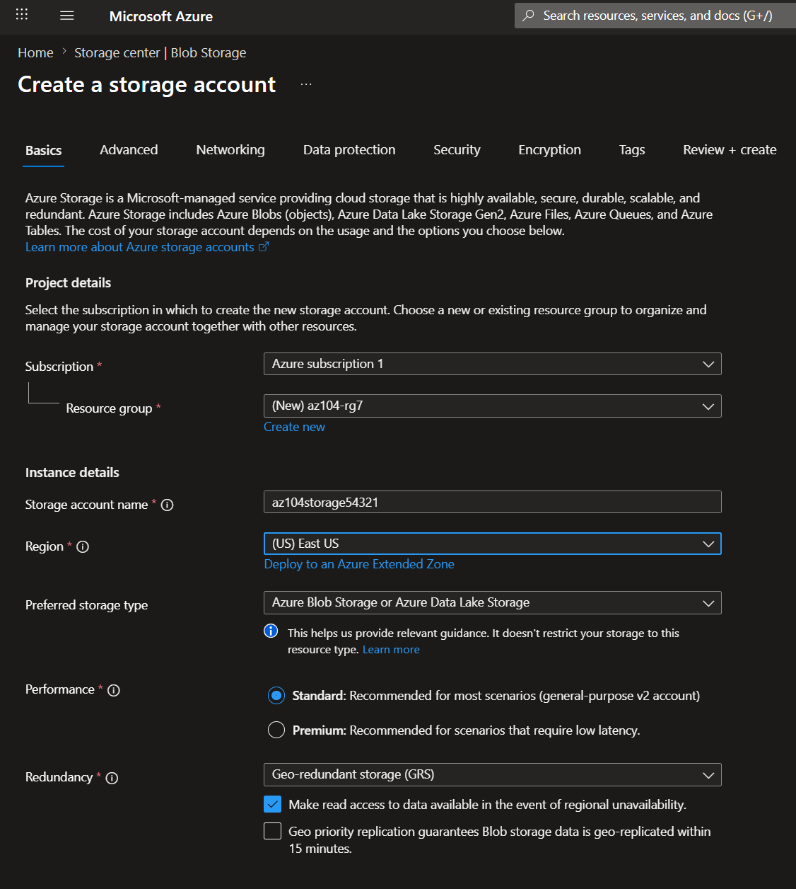

### Lifecycle Management Rule

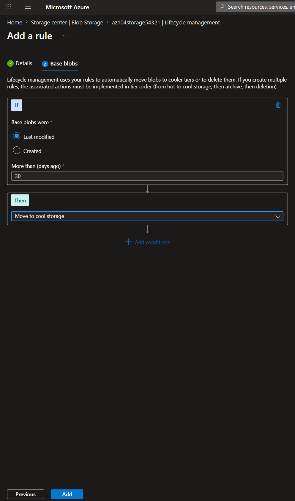

### Blob Container Creation

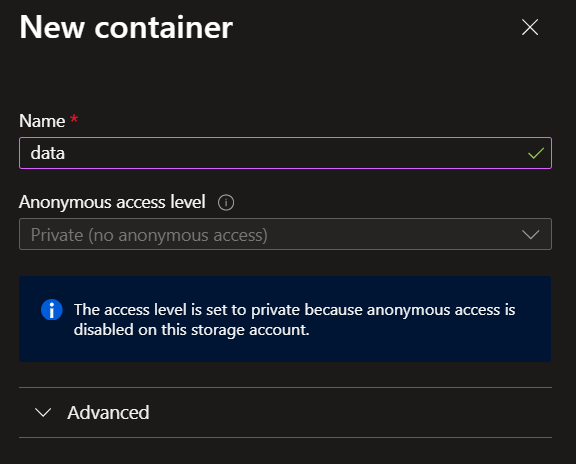

### Immutable Retention Policy

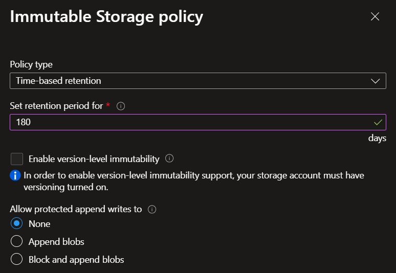

### RBAC Role Assignment

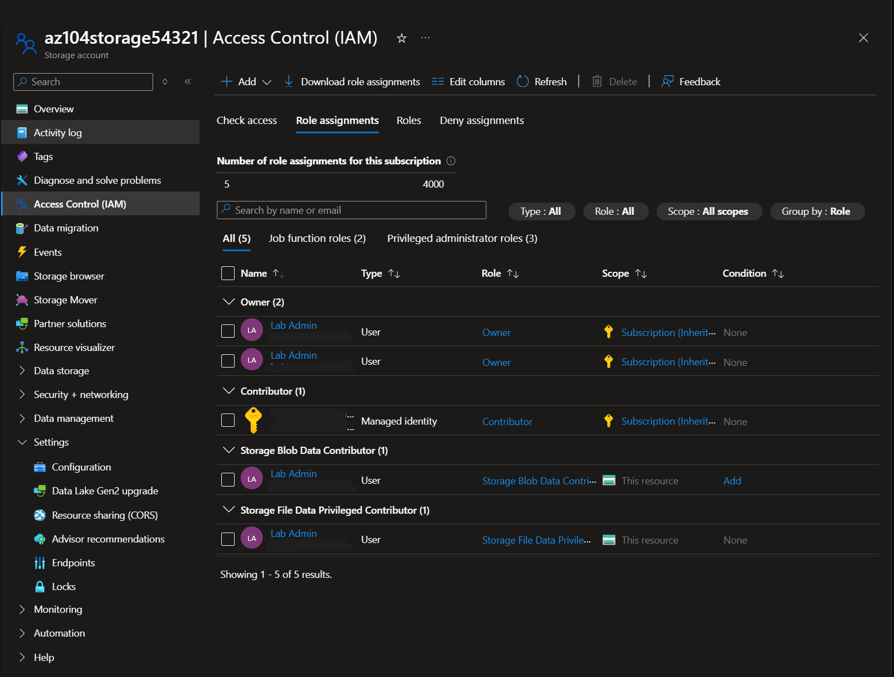

### Blob Upload

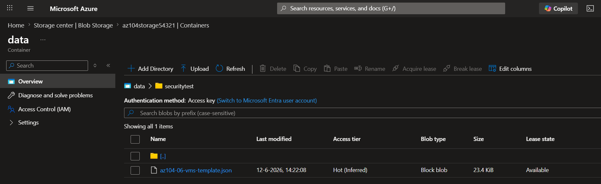

### Public Access Denied

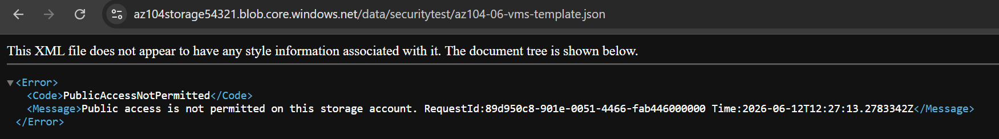

### SAS Access Working

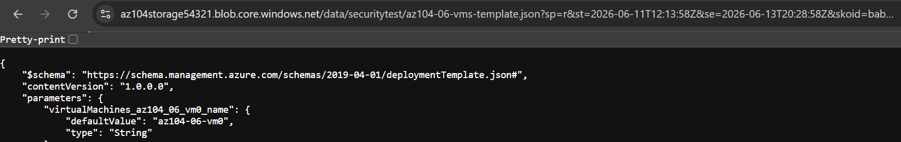

### Azure File Share Creation

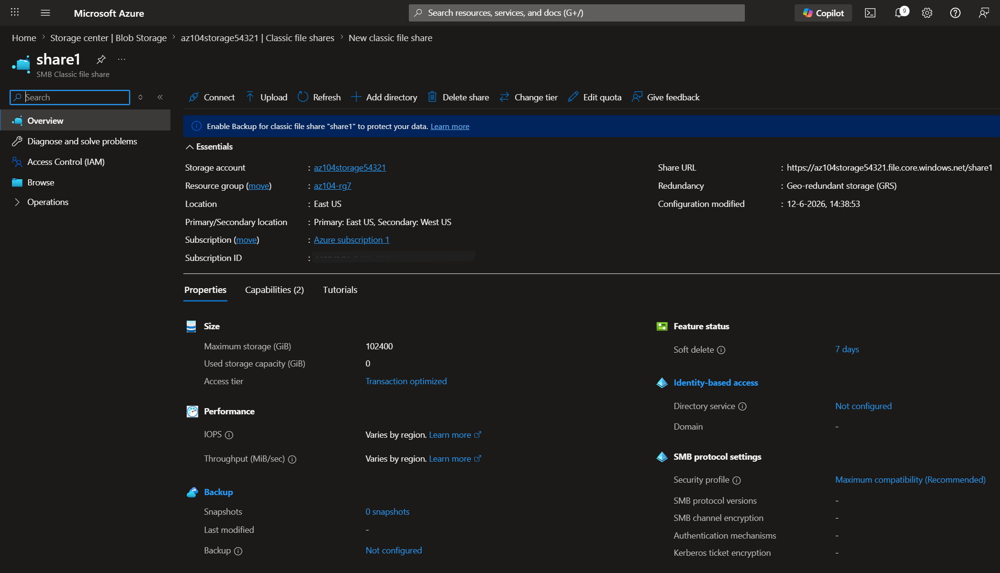

### File Upload via Storage Browser

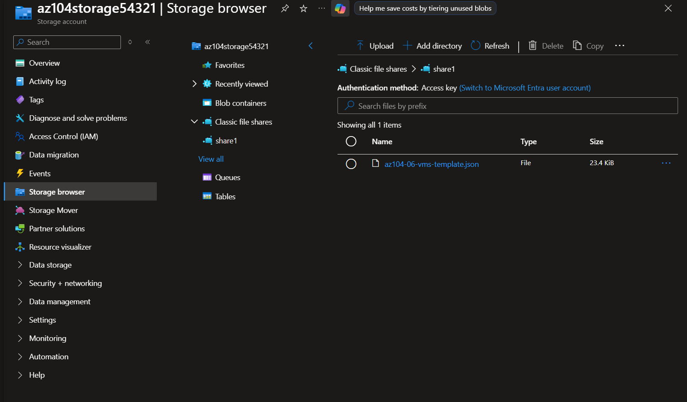

### Service Endpoint Configuration

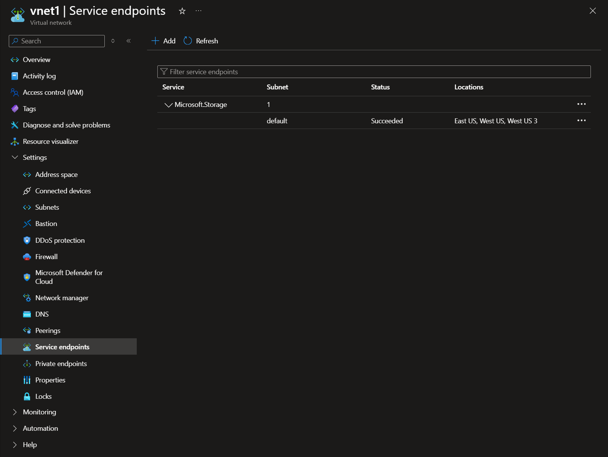

### Storage Network Restriction

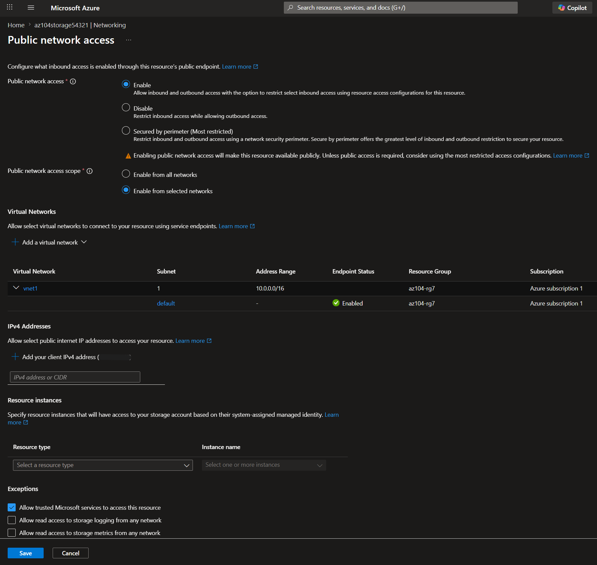

### Access Denied After Network Lockdown

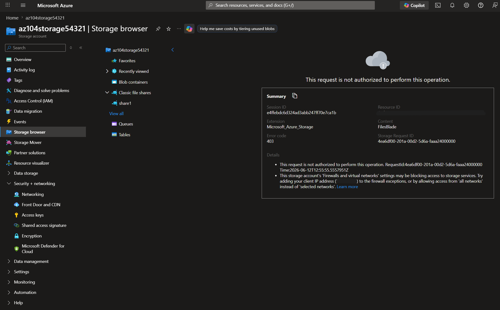

---

## 🧠 Key Engineering Concepts

### Azure Storage Account

A globally unique storage namespace that provides access to:

* Blob Storage
* File Shares
* Queues
* Tables

Storage accounts act as the foundational building block for Azure Storage services.

---

### Blob Storage

Object storage designed for unstructured data such as:

* Documents
* Images
* Backups
* Logs

Supports:

* Access tiers (Hot, Cool, Archive)
* Lifecycle management
* Immutable storage
* Shared Access Signatures

---

### Azure Files

Managed file shares accessible through the SMB protocol.

Benefits include:

* Centralized file storage
* Hybrid cloud integration
* Identity-based access control

---

### Role-Based Access Control (RBAC)

RBAC provides identity-based authorization using Microsoft Entra ID.

Benefits:

* Least privilege access
* Centralized permissions management
* Reduced dependency on storage account keys

---

### Shared Access Signatures (SAS)

SAS tokens provide temporary delegated access to storage resources.

Benefits:

* Limited permissions
* Time-based access
* Secure external sharing

---

### Service Endpoints

Service Endpoints securely connect Azure resources to Azure Storage through the Azure backbone network.

Benefits:

* Improved security
* Reduced public exposure
* Network-level access control

---

## ⚠️ Challenges & Learnings

* Understanding the difference between RBAC and SAS authentication
* Configuring immutable blob retention policies
* Managing secure blob access without enabling public access
* Restricting storage account access using virtual networks
* Understanding how Service Endpoints secure Azure Storage communication
* Validating security controls through access testing

---

## 💼 Business Value

This solution demonstrates how Azure Storage can securely host enterprise data while maintaining scalability, availability, and cost efficiency.

Benefits include:

* Cost optimization through lifecycle management
* Protection against accidental deletion
* Secure identity-based access control
* Temporary delegated access through SAS
* Regional redundancy with GRS
* Controlled network exposure
* Improved data governance and compliance

---

## 🚀 Beyond the Lab

In production environments, this solution would typically include:

* Azure Backup integration
* Private Endpoints
* Customer-managed encryption keys
* Azure Monitor integration
* Microsoft Defender for Storage
* Azure Policy compliance controls
* Multi-region disaster recovery planning

---

## 🧰 Technologies Used

* Microsoft Azure Portal
* Azure Storage Accounts
* Azure Blob Storage
* Azure File Shares
* Microsoft Entra ID
* Azure RBAC
* Shared Access Signatures (SAS)
* Azure Virtual Networks
* Service Endpoints
* Lifecycle Management Policies

---

## 🚀 Next Steps

This lab provides the foundation for more advanced Azure storage and security solutions:

* Azure Data Lake Storage Gen2
* Private Endpoints
* Azure Backup
* Azure Site Recovery
* Azure Storage Replication Strategies
* Storage Security Best Practices
* Hybrid File Storage Architectures
